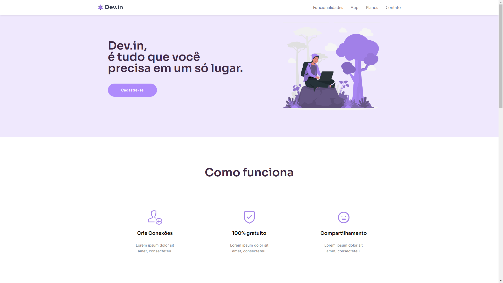

# 
 Dev.in 
 
  

 This project is a landing page, with the focus of presenting a community of developers to connect and network. I built with React, ionicons and tailwindcss. Project dedicated to learning and my study for my evolution as a programmer

Preview: 

#### <h3 align="center">**This project was developed with** </strong></h3>

#### <h3 align="center">React | TailwindCSS | Figma | Git | GitHub </h3>

#

#### 
[Access my profile on LinkedIn here](https://www.linkedin.com/in/lucas-capella-/) 
